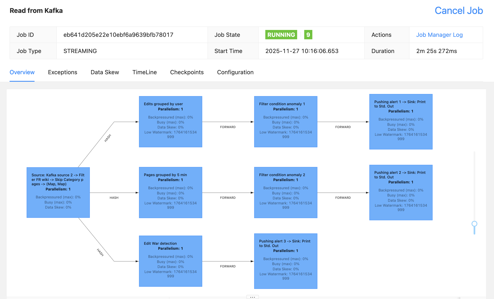
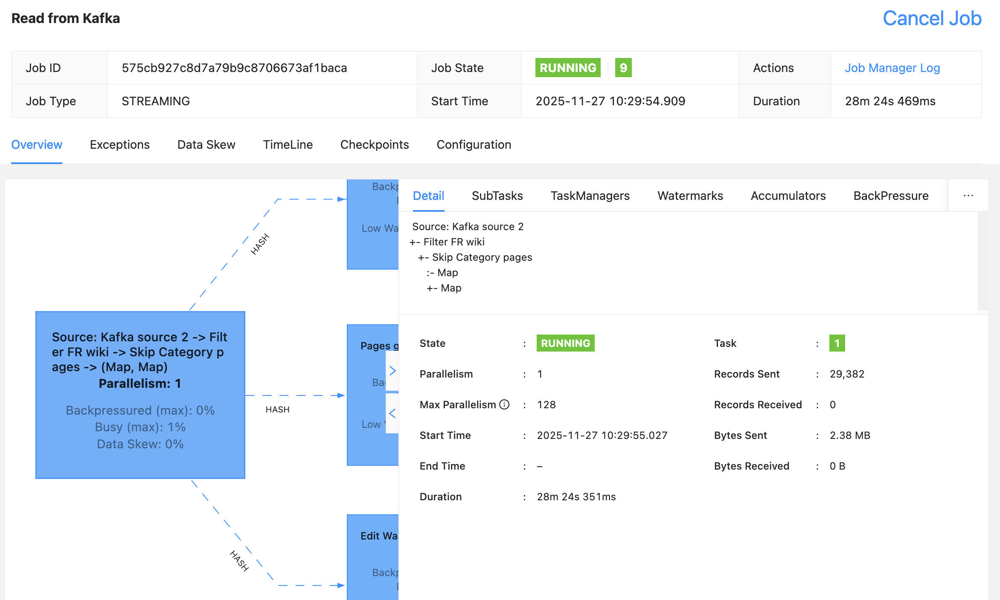

# Scala - Flink

Start a Flink cluster and execute Scala code in it.

This is code for versions:

- Flink: 1.20.3
- Scala: 2.12.18

|    Lineage of Flink tasks    |          N of messages sent           |
| :--------------------------: | :-----------------------------------: |
|  |  |

## Available commands

Locally:

```sh
# Execute the Flink code
make local.run
```

On the cluster:

```sh
# Build locally the JAR to be sent to the cluster
make cluster.build
# Send the JAR to the cluster and run it
make cluster.submit
# Show logs of the job in the cluster
make cluster.logs
```

## Stream Wikipedia changes

To ingest Wikipedia changes into the Kafka cluster:

```sh
# Go to folder streaming-kafka
cd ../streaming-kafka
# Start streaming data
make streaming
```
